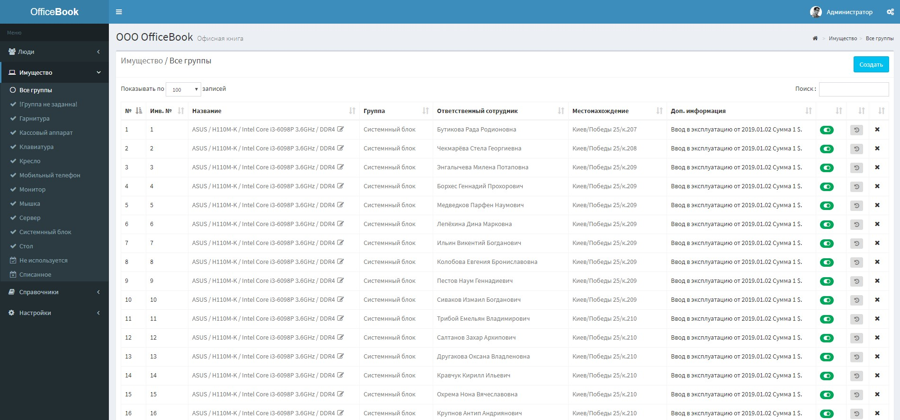

# OfficeBook Invent

Веб-приложение OfficeBook Invent предназначено для учета материальных ценностей организации.



### Требования к хостингу:
* Apache
* MySQL
* PHP >= 7.1.3

### Используемые технологии:
* PHP Framework Laravel v5.8
* Control Panel Template AdminLTE
* Bootstrap 3 и 4
* DataTables example

### Возможности
* Создания справочника сотрудников.
* Для справочника сотрудников используются дополнительные справочники: должность, адрес рабочего места сотрудника, рабочий e-mail.
* Создания справочника материальных ценностей (имущества) с закреплением за каждой единицей ответственного сотрудника, указанием местонахождения и группы и статуса (используется, не используется, списан).
* Для справочника материальных ценностей дополнительно используются справочники: группа, и местонахождение.
* Запись истории изменений данных по каждое материальной единице
* Импорт данных из таблицы MS Excel в справочники сотрудников и материальных ценностей.
* Экспорт данных в MS Excel с справочников сотрудников, материальных ценностей и истории.
* Распределение прав доступа для пользователей приложения по ролям с возможность менять доступы к данным на просмотр, редактирования и удаления данных.

### Установка: способ №1
1. В консоли на сервере хостинга в папке сайта запустить команду 
    ```
    git clone https://github.com/ITLux/OfficeBook-Inventory.git
    ```
2. Загрузитися приложение в папку OfficeBook-Inventory, скопируете содержимое в корневой каталог
3. Обновить зависимости проекта:
    ```
    composer update
    ```
4. Создать файл .env в корне проекта
5. Скопировать в него текст с файла .env.example
6. Добавить в файл .env название хоста, параметры подключения к базе MySQL и e-mail с паролем для отправки уведомлений.
    ```
    APP_URL=http://localhost
    
    DB_CONNECTION=mysql
    DB_HOST=127.0.0.1
    DB_PORT=3306
    DB_DATABASE=ob
    DB_USERNAME=homestead
    DB_PASSWORD=secret
        
    MAIL_DRIVER=smtp
    MAIL_HOST=smtp.gmail.com
    MAIL_PORT=587
    MAIL_USERNAME=obmydomen@gmail.com
    MAIL_PASSWORD=Password
    MAIL_ENCRYPTION=tls
    ```
7. Сенирировать ключ приложения
    ```
    php artisan key:generate
    ```
8. Закешировать данние настроек
    ```
    php artisan config:cache
    ```
9. Создать таблицы в базе MySQL
    ```
    php artisan migrate
    ```
10. Заполнить базу данных начальными данными
    ```
    php artisan db:seed --class=OBITableSeeder
    ```

### Установка: способ №2
1. Скачать архив приложения [здесь](http://itlux.com.ua/upload/OfficeBook-Inventory_v.1.0.2.zip)
2. Загузить в на хостинг
3. Распаковать
4. Создать файл .env в корне проекта
5. Скопировать в него текст с файла .env.example
6. Добавить в файл .env название хоста и e-mail с паролем для отправки уведомлений и параметры подключения к базе MySQL.
7. Создать базу и импортировать в нее данные с файла ob.sql, например через PhpMyaAdmin

### Вход в админку:
* Логин: admin@mydomen.com
* Пароль: password

### Демо: [ob.itlux.com.ua](http://ob.itlux.com.ua)

Администратор <br/>
Логин: admin@mydomen.com<br/>
Пароль: password

Пользователь <br/>
Логин: vvasilev@gmail.com<br/>
Пароль: password

### Лицензия
OfficeBook Inventory это программное обеспечение с открытым исходным кодом, лицензированное по [MIT license](http://opensource.org/licenses/MIT).

[Installation instructions in English](/README_EN.md)

