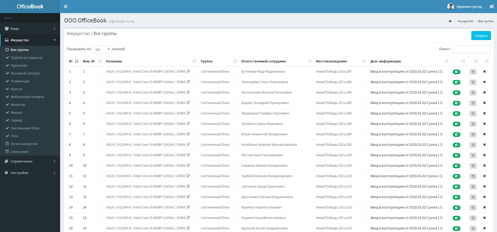

# OfficeBook Invent

### About
OfficeBook Inventory is a web application for property accounting.



### Installation
1. From the projects root run
    ```
    git clone https://github.com/ITLux/OfficeBook-Inventory.git
    composer update
    cp .env.example .env
    ```
2. Configure your `.env` file
    * `APP_URL=http://ob.mydomen.com`
    * `DB_HOST=127.0.0.1`
    * `DB_DATABASE=ob`
    * `DB_USERNAME=ob`
    * `DB_PASSWORD=password`
    * `MAIL_USERNAME=myemail@gmail.com`
    * `MAIL_PASSWORD=password`

3. Run
    ```
    php artisan key:generate
    php artisan config:cache
    php artisan migrate
    php artisan db:seed --class=OBITableSeeder
    ```

[Installation instructions in Russian](http://itlux.com.ua/officebook)


### Seeded Credentials
* User: admin@mydomen.com
* Pass: password

### License
OfficeBook Inventory is an open-source software licensed under the [MIT license](http://opensource.org/licenses/MIT).